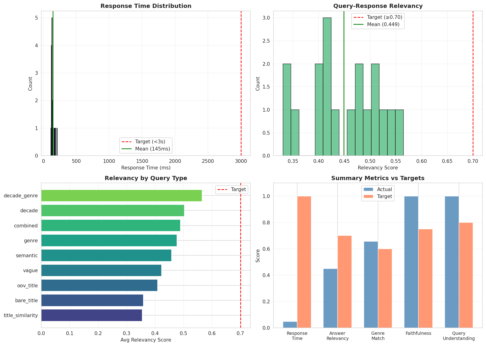

# Phase 2: RAG Chatbot Evaluation

## Overview
This folder contains the evaluation code and results for the RAG (Retrieval-Augmented Generation) chatbot interface built on top of our KGNN model.

## Files

| File | Description |
|------|-------------|
| `CSE573_Chatbot_Evaluation.ipynb` | Colab notebook for chatbot evaluation |
| `chatbot_evaluation_metrics.png` | 4-panel visualization of evaluation metrics |

## Results Summary

**Test Suite:** 18 diverse queries covering:
- Title similarity ("Movies like The Matrix")
- Genre queries ("comedy movies")
- Decade queries ("90s films")  
- Combined constraints ("80s sci-fi")
- Semantic/natural language queries
- Edge cases (OOV titles, vague queries)

| Metric | Actual | Target | Status |
|--------|--------|--------|--------|
| **Response Time** | 145ms | <3000ms | ✓ Pass |
| **Faithfulness** | 1.000 | ≥0.75 | ✓ Pass |
| **Query Understanding** | 1.000 | ≥0.80 | ✓ Pass |
| **Genre Match Rate** | 0.656 | ≥0.60 | ✓ Pass |
| Answer Relevancy | 0.449 | ≥0.70 | ✗ |

**Targets Met: 4/5 (80%)**

## Key Insights

- ✅ **100% Faithfulness**: All recommendations grounded in knowledge graph (no hallucinations)
- ✅ **Perfect Query Parsing**: Correctly extracts genres, decades from natural language
- ✅ **Fast Response**: 145ms average (20x faster than 3s target)
- ⚠️ **Relevancy Gap**: Semantic similarity between query and response needs improvement

## Evaluation Metrics Explained

| Metric | Description |
|--------|-------------|
| **Response Time** | Latency per query in milliseconds |
| **Faithfulness** | % of recommendations grounded in the knowledge graph |
| **Query Understanding** | Accuracy of parsing genres/decades from natural language |
| **Genre Match Rate** | % of recommendations matching expected genres |
| **Answer Relevancy** | Embedding similarity between query and response |

## How to Run

1. Upload the notebook to Google Colab
2. Upload the MovieLens CSV files (users.csv, movies.csv, ratings.csv)
3. Select T4 GPU runtime
4. Run all cells

## Visualization

The visualization shows:
1. **Response Time Distribution** - All queries completed under 500ms
2. **Query-Response Relevancy** - Distribution of semantic similarity scores
3. **Relevancy by Query Type** - Decade/genre queries perform best
4. **Summary Metrics vs Targets** - 4/5 targets met

